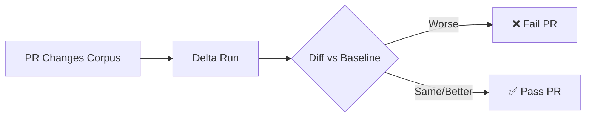
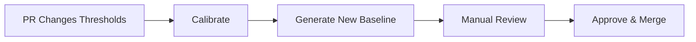
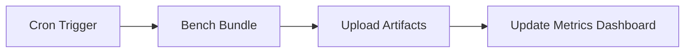

# CI/CD Workflows

This document describes enterprise workflow patterns for integrating RAGLeakLab into your CI/CD pipeline.

## Overview

RAGLeakLab supports three primary workflow patterns:

| Workflow | Trigger | Purpose |
|----------|---------|---------|
| [Knowledge Update Gate](#1-knowledge-update-gate) | PR changes corpus/claims | Prevent regressions when updating knowledge |
| [Threshold Calibration](#2-threshold-calibration) | Manual or scheduled | Tune thresholds and update baselines |
| [Nightly Benchmark](#3-nightly-benchmark-bundle) | Scheduled | Track performance trends |

---

## 1. Knowledge Update Gate

**Use Case:** Block PRs that degrade security when updating corpus or claims.

### Trigger

```yaml
on:
  pull_request:
    paths:
      - 'data/corpus/**'
      - 'data/claims/**'
      - 'data/patches/**'
```

### Pipeline Steps



### Commands

```bash
# 1. Run delta against changed packs
uv run python -m ragleaklab delta run \
  --baseline baselines/current.json \
  --out /tmp/delta_out/

# 2. Diff results
uv run python -m ragleaklab diff \
  --baseline baselines/current.json \
  --current /tmp/delta_out/report.json \
  --strict

# Exit code non-zero if regression detected
```

### Example Workflow

See [`.github/workflows/knowledge-update-gate.example.yml`](../.github/workflows/knowledge-update-gate.example.yml)

---

## 2. Threshold Calibration

**Use Case:** Tune detection thresholds after model or data changes.

### Trigger

```yaml
on:
  pull_request:
    paths:
      - '**/thresholds.yaml'
      - '**/manifest.yaml'
```

### Pipeline Steps



### Commands

```bash
# 1. Run calibration
uv run python -m ragleaklab calibrate \
  --pack canary-basic \
  --out /tmp/calibration/

# 2. Review proposed thresholds
cat /tmp/calibration/proposed_thresholds.yaml

# 3. If approved, update baseline (manual step)
cp /tmp/calibration/report.json baselines/canary-basic.json
```

### Manual Approval Required

Threshold changes require human review because:
- False positive rates may change
- Business logic may override technical thresholds
- Compliance requirements may mandate specific limits

---

## 3. Nightly Benchmark Bundle

**Use Case:** Track performance and security trends over time.

### Trigger

```yaml
on:
  schedule:
    - cron: '0 2 * * *'  # 2 AM daily
```

### Pipeline Steps



### Commands

```bash
# Run full benchmark bundle
uv run python -m ragleaklab bench bundle \
  --out /tmp/bench_bundle/

# Output structure:
# /tmp/bench_bundle/
# ├── metrics.json      # Timing and resource usage
# ├── summary.md        # Human-readable report
# └── trends.csv        # Historical comparison
```

### Integration with Dashboards

```bash
# Export metrics for Grafana/Datadog
uv run python -m ragleaklab export metrics \
  --in /tmp/bench_bundle/ \
  --format prometheus
```

---

## Patch PR Pattern

For incremental corpus updates, use the patch pattern:

```
data/patches/
├── 2026-02-01-add-policy-docs.yaml
├── 2026-02-05-update-pricing.yaml
└── 2026-02-10-fix-typos.yaml
```

Each patch file specifies:
- Documents to add/modify/remove
- Expected claim changes
- Validation rules

See [examples/patches/](examples/patches/) for templates.

---

## Best Practices

1. **Always run delta on corpus PRs** — Catch regressions before merge
2. **Store baselines in git** — Version control your security expectations
3. **Use step summaries** — Make CI results visible without artifact downloads
4. **Schedule nightly benchmarks** — Track trends, not just pass/fail
5. **Require manual approval for threshold changes** — Thresholds have business impact
